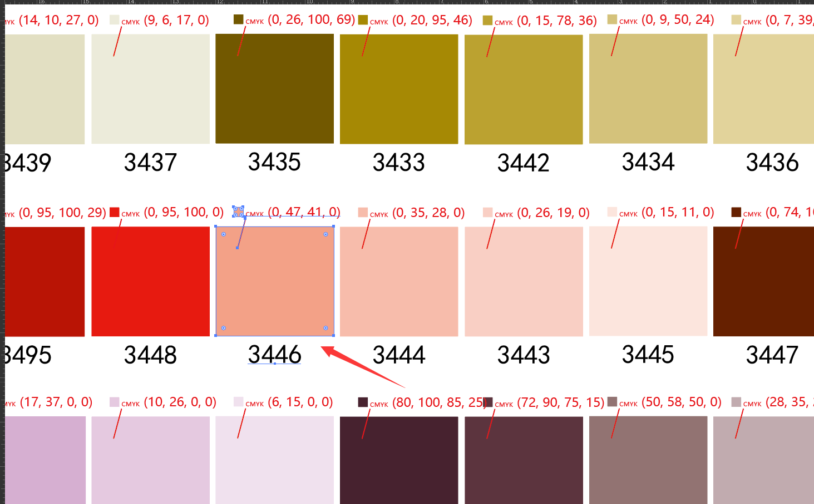

# Select Group By Text Match

> [By request on Illustrator forums here](https://community.adobe.com/t5/illustrator-discussions/does-illustrator-have-such-a-script/td-p/13681899).

Given a document containing text labels inside groups like example below, create a prompt allowing a comma-delimited string to select groups containing matching text:

Seeing the way others were approaching how to script this made me curious to try. The initial script given to OP had a flow something like:

- Use input prompt to get target strings
- Loop through every `GroupItem` in document
- Loop through every `TextFrameItem` in this Group
- Loop through every comma-separated string to check for match
- If match, add initial group to selection and remove group from first loop

Having 3 nested loops felt inefficient to me especially considering how laggy Illustrator gets looping through large documents and how the most intensive parent loop would be redundant if groupItems had no text or reason to be looped. My approach was instead:

- Construct a dynamic `RegExp` which matches from any of the comma-separated values from input prompt
- Loop through every `TextFrameItem` and filter this list to only items matching the RegExp
- Map this result array as a recursive `parent` lookup, breaking on `GroupItem` typenames
- ForEach the final list and select them but only if the result is not `null` (which would happen if TextFrameItem > Document > Application was parentage and it did not exist in group)
